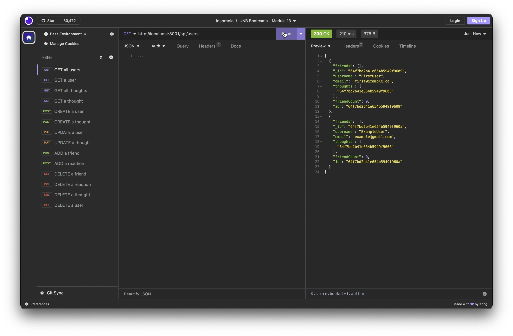
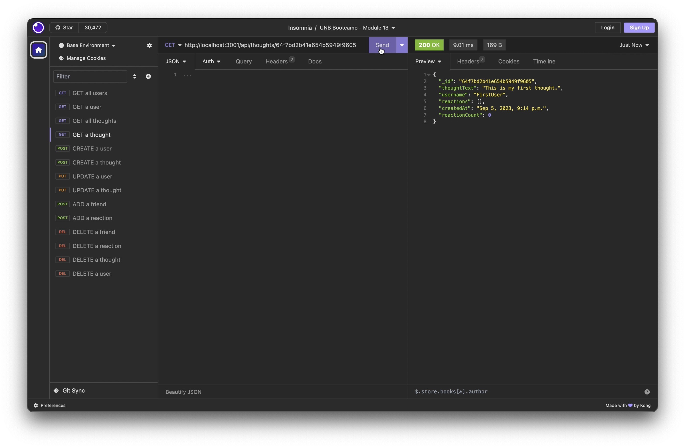
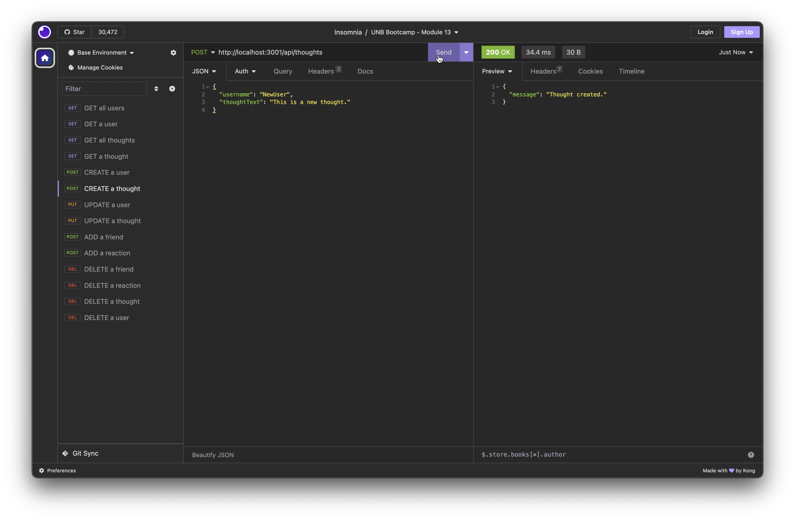

# Social Network Back-end API

## Description

This project is the back-end API of a social networking website. We use Express.js, MongoDB, and Mongoose to create and manage a NoSQL database that stores information about users, their thoughts, and reactions to thoughts.

During the project, I learned how to properly set up Mongoose schema and models, and the controller functions needed for each API endpoint. I gained experience working with NoSQL databases, and furthered my knowledge of express servers.

## Table of Contents

- [Installation](#installation)
- [Usage](#usage)
- [Credits](#credits)
- [License](#license)

## Installation

To install this project, follow these steps:

1. Download the contents of the repository: https://github.com/stms15/social-network-noSQL-API
2. Run `npm i` or `npm install` in your terminal to install all required packages. **Note**: make sure you have NoSQL and MongoDB isntalled on your conputer.
3. Run `npm run seed` to seed the database with the existing seed data, or create your own seed data.
4. Run `npm run start` to start the server and access the api with localhost:3001/api.

## Usage

As mentioned in the previous section, you first need to download the files and make sure all necessary packages and software are installed. Then seed the data, or create your own, and run `npm run start` to start the server.

Once the server is running, you can access the api with `http://localhost:3001/api`. The easiest way to use the API is with a software like Insomnia. Below is a list of all routes/endpoints for the API with a photo example of how to use them. A full tutorial on how to use the API can be found here: https://drive.google.com/file/d/1bizF28JAfT2ns74DsSSzvssinjWRIfu_/view?usp=sharing.

1. #### GET all users or thoughts

API endpoint: `http://localhost:3001/api/users`
API method: GET

API endpoint: `http://localhost:3001/api/thoughts`
API method: GET

2. #### GET a single user or thought by id

API endpoint: `http://localhost:3001/api/users/:thoughtId`
API method: GET

API endpoint: `http://localhost:3001/api/thoughts/:thoughtId`
API method: GET

3. #### CREATE a new user or thought

API endpoint: `http://localhost:3001/api/users`
API method: POST

API endpoint: `http://localhost:3001/api/thoughts`
API method: POST

4. #### ADD a friend to a user or reaction to a thought

API endpoint: `http://localhost:3001/api/users/:userId/friends/:friendId`
API method: POST

API endpoint: `http://localhost:3001/api/thoughts/:thoughtId/reactions`
API method: POST

5. #### UPDATE a user or thought

API endpoint: `http://localhost:3001/api/users/:userId`
API method: PUT

API endpoint: `http://localhost:3001/api/thoughts/:thoughtId`
API method: PUT

6. #### DELETE a friend of a user or a reaction to a thought

API endpoint: `http://localhost:3001/api/users/:userId/friends/:friendId`
API method: DELETE

API endpoint: `http://localhost:3001/api/thoughts/:thoughtId/reactions/:reactionId`
API method: DELETE

7. #### DELETE a user or thought by id

API endpoint: `http://localhost:3001/api/users/:userId`
API method: DELETE

API endpoint: `http://localhost:3001/api/thoughts/:thoughtId`
API method: DELETE

**Note** that the "get a single user or thought", "add a friend or reaction", "update a user or thought", and "delete a friend, reaction, user, or thought" routes all require the ids of the objects to modify. The update and create methods accept a JSON formatted body. The required fields for the POST methods are as follows.

- Create a user: `{ "username": "__", "email": "__" }`,
- Create a thought: `{ "thoughtText": "__", "username": "__" }`,
- Add a reaction: `{ "reactionBody": "__", "username": "__" }`.

## Credits

The email validator used was found in this Stack Overflow thread: https://stackoverflow.com/questions/18022365/mongoose-validate-email-syntax.

## License

For more information about this license, please see the `LICENSE` file or visit https://spdx.org/licenses/MIT.html.

---

## Badges

